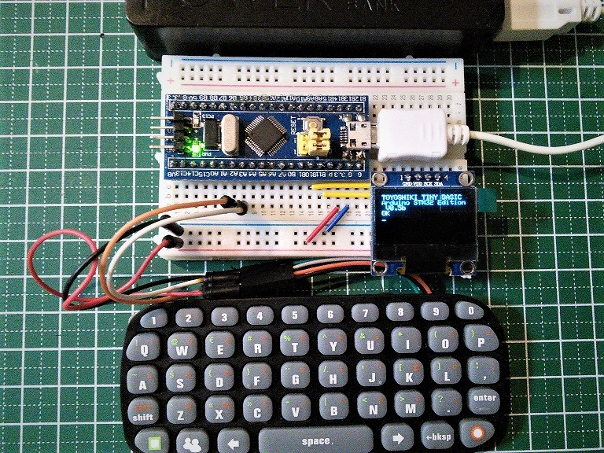

# Arduino STM32 Xbox Chatpad ライブラリ

**_※本バージョンは β 版です.大幅に仕様変更する可能性があります._**

- [豊四季 TinyBASIC Ver0.87β](https://github.com/Tamakichi/ttbasic_arduino_stm32)に対応しました <span style="color:red;">**(NEW)**</span>
- [日本語表記](#日本語表記)のチャットパッドに対応しました

## これは何？

Xbox Chatpad を Arduino 化した STM32F103 でキーボードとして使うためのライブラリです.
Microsoft 製の Xbox Chatpad で動作しますが、Microsoft 製の Xbox Chatpad が入手しにくいため、比較的入手しやすいクローン(例えば、TYX-517PCB1 Ver2.5)が代替品として使用出来ます.  
Microsoft 製の Xbox Chatpad は、クローンより高速に起動します.

<span style="color:red;">※動画のように豊四季 Tiny BASIC で動作させるたためには、豊四季 Tiny BASIC の[改造](#改造)が必要です.本ライブラリを置き換えただけでは Tiny BASIC での動作はできません.ご注意ください.</span>

**写真をクリックすると動画再生します**

[](https://www.youtube.com/watch?v=LU9IOJWQZ0k&vl=ja)

本ライブラリは STM32F103CB を使用した Blue Pill、Black Pill で動作の確認をしています.
本ライブラリは次を参考に作成しています.

> - たま吉さん https://github.com/Tamakichi/ArduinoSTM32_PS2Keyboard
> - Cliff L. Biffle http://cliffle.com/project/chatpad

## 著作権/使用条件(License)

**このアーカイブに含まれるソースコード、テキスト及びデータ**の著作権は**Kei Takagi**が所有しています.  
Xbox Chatpad の改造や、本アプリケーションの使用は、使用者個人の責任のもとに行ってください.  
本アプリケーションを実行した結果について何らかの不具合が発生したとしても、作者は一切の責任を負いませんので、あらかじめご了承ください.  
著作権者の同意なしに金銭を伴う再配布を行う事を固く禁じます.  
この条件のもとで、利用、複写、改編、再配布を認めます.

**「豊四季 Tiny BASIC」**の著作権は開発者の**Tetsuya Suzuki**氏にあります.  
「豊四季 Tiny BASIC」を使用した場合のプログラム利用については、オリジナル版の著作権者の配布条件に従うものとします.  
著作権者の同意なしに経済的な利益を得てはいけません.  
この条件のもとで、利用、複写、改編、再配布を認めます.

## Xbox Chatpad の改造

### 1.ケース


### 2.前面


### 3.背面


### 4.分解します


### 5.基盤を取り出します


### 6.不要な配線を取り除きます.必要な配線は以下の写真を参考にしてください.

写真では、取り外したネジとワッシャーで止めていますが、キーボードの中心のボタンを強く押すと、意図しないキー反応があります.  
キーボードを押しても曲がらないよう、硬い板を当てるなど工夫してください.


配線ですが、上から、

- ブラック : 3.3V へ接続
- オレンジ : STM32F103 の Serial2 である PA2 へ接続
- グレー : STM32F103 の Serial2 である PA3 へ接続
- グリーン : GND へ接続

になります. \***\*<span style="color:red;">（配線の色に惑わされないよう注意）</span>\*\***

## 使い方

基本的な使い方のサンプルは、XboxChatpad_exsample.ino に置いておきます.  
最初にサンプルで Xbox Chatpad の動作を確認してから豊四季 Tiny BASIC 等で使用してください.  
Xbox Chatpad クローンの場合、電源投入から 2 ～ 5 秒程使用出来ない時間があります.  
気になる方は XboxChatpad.h を修正してください.

<a name="改造"></a>

## たま吉さんの豊四季 Tiny BASIC で使用したい場合

**[豊四季 Tiny BASIC for Arduino STM32](https://github.com/Tamakichi/ttbasic_arduino_stm32)の手順に沿ってインストールしたあと、[差替ファイル](https://github.com/KeiTakagi/XboxChatpad/blob/master/ttbasic_difference/ps22tty.cpp)を差し替えてください.**

## キーボードに印刷されていないキー操作について

| **動作**                 | **操作**  |
| ------------------------ | --------- |
| 上移動                   | 緑 □ + →  |
| 下移動                   | 緑 □ + ←  |
| 実行中のプログラム停止 1 | 緑 □ + C  |
| 実行中のプログラム停止 2 | 人 + E    |
| 画面初期化               | 人 + L    |
| !                        | shift + 1 |
| "                        | shift + 2 |
| #                        | shift + 3 |
| \$                       | shift + 4 |
| %                        | shift + 5 |
| &                        | shift + 6 |
| '                        | shift + 7 |
| (                        | shift + 8 |
| )                        | shift + 9 |

<a name="日本語表記"></a>

## 日本語表記の Xbox Chatpad を使用する場合

「カナひら」「漢字」を押すとキーボードの印刷にない「.」「,」を表示します.
XboxChatpad.h の下記のように『JAPAN_KEY 0』(英語版)から『JAPAN_KEY 1』（日本語版）へ修正してください

```
// 日本語表記のチャットパット対応
// #define JAPAN_KEY 0 ←英語版(デフォルト)
// #define JAPAN_KEY 1 ←日本語版
#define JAPAN_KEY 1
```

## キーボードの定義を変えたい場合

キーボードの定義を変更したい場合は XboxChatpad.h の sAsciiTable[] を変更してください.  
配列の順番は、Normal, shif, Green, orange , People になります.

## 豊四季 Tiny BASIC 以外で使いたい場合

Serial からの入力や、PS/2 キーボードライブラリと置き換えて使用する際は、Sirialx.available() Sirialx.read()と置き換えることになるかと思います.  
使用例を参考に置き換えてください.
あわせて、[豊四季 TinyBasic Ver0.85 以前のバージョンで使用する場合](#TTBASIC086)も対応してください.

```
使用例）

#include <XboxChatpad.h>

XboxChatpad kb;
inline char c_getch(void) {
  uint8_t c = 0;
  keyEvent k = kb.read();
  if ( k.code && k.code != KEY_ERROR) {
    if (k.BREAK)c = k.code; // キーを離した
  }
  return c;
}
#define c_kbhit( ) kb.available()

Sirialx.available() ← c_kbhit()で置き換え
Sirialx.read()      ← c_getch()で置き換え
```

<a name="TTBASIC086"></a>

## 豊四季 TinyBasic Ver0.85 以前のバージョンで使用する場合

デフォルトは豊四季 TinyBasic Ver0.86 以降の設定にしています。
XboxChatpad.h の下記のように『TTBASIC086 1』(豊四季 TinyBasic 0.86 以降)から『TTBASIC086 0』（豊四季 TinyBasic 0.85 以前）へ修正してください

```
// 豊四季TinyBasick個別バージョン対応
// #define TTBASIC086 0 ←豊四季TinyBasic 0.85以前
// #define TTBASIC086 1 ←豊四季TinyBasic 0.86以降 デフォルト
#define TTBASIC086 0
```

## 問題点

- キーリピートを実装したところ、処理中にキーを離した状態を取得出来ないため見送ります.そのため、キーを離したタイミングで文字を表示する仕様とします.

## 今後の予定について

- なし
