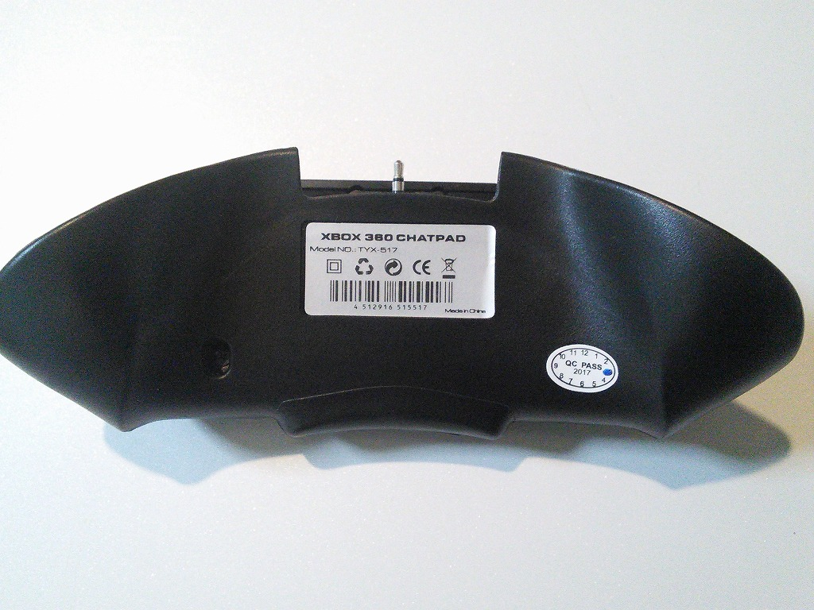

# Arduino STM32 Xbox Chatpad Clone ライブラリ
**※まだ、製作途中です。大幅に仕様が変更になる可能性があります。ご了承ください。**

##これは何？

XBOX Chatpad clone(TYX-517PCB1 Ver2.5で確認)をArduino化したSTM32F103でキーボードとして使うためのライブラリです。

++++下の写真をクリックすると動画再生されます++++
[](https://www.youtube.com/watch?v=LU9IOJWQZ0k&vl=ja)

Xbox Chatpadは3.3Vで動作します。
3.3Vで動作するArduino Dueで動作するかもしれませんが、確認は行っていません。

本ライブラリは次を参考に作成しました
> - たま吉さん      https://github.com/Tamakichi/ArduinoSTM32_PS2Keyboard
> - Cliff L. Biffle http://cliffle.com/project/chatpad

##Xbox Chatpadの改造
###ケース

###キーボードの前面

###キーボードの背面

###分解します

###基盤を取り出してください

###不要な配線を取り除きます。必要な配線は以下の写真のようになります。


配線ですが、上から、
- ブラック : 3.3Vへ接続
- オレンジ : STM32F103のSerial2であるPA2へ接続
- グレー : STM32F103のSerial2であるPA3へ接続
- グリーン : GNDへ接続

##使い方
基本的な使い方のサンプルは、XboxChatpad_exsample.inoに置いておきます。
Chatpadは電源投入から2～５V秒ほどは使用できません。ご注意ください。

##キーボードの定義を変えたい場合は？
キーボードの定義を変更したい場合はXboxChatpad.cppのsAsciiTable[] を変更してください。
配列の順番は、Normal, shifted, Green, orange , Peopleになります。

##Serial入力やキーボードライブラリと置き換えたい
TynyBasicではSerialからの入力や、PS/2キーボードから実際使用する際は、Sirialx.available() Sirialx.read()と置き換えることになるかと思います。
使用例を参考に置き替えてください。

使用例）
```
#include <XboxChatpad.h>

XboxChatpad kb;
inline char c_getch(void) {
  char c = 0;
  keyEvent k = kb.read();
  if ( k.code && k.code != KEY_ERROR) {
     if (k.BREAK)c = k.code;
  }
  return c;
}
#define c_kbhit( ) kb.available()

Sirialx.available() ← c_kbhit()で置き換え
Sirialx.read()      ← c_getch()で置き換え

```