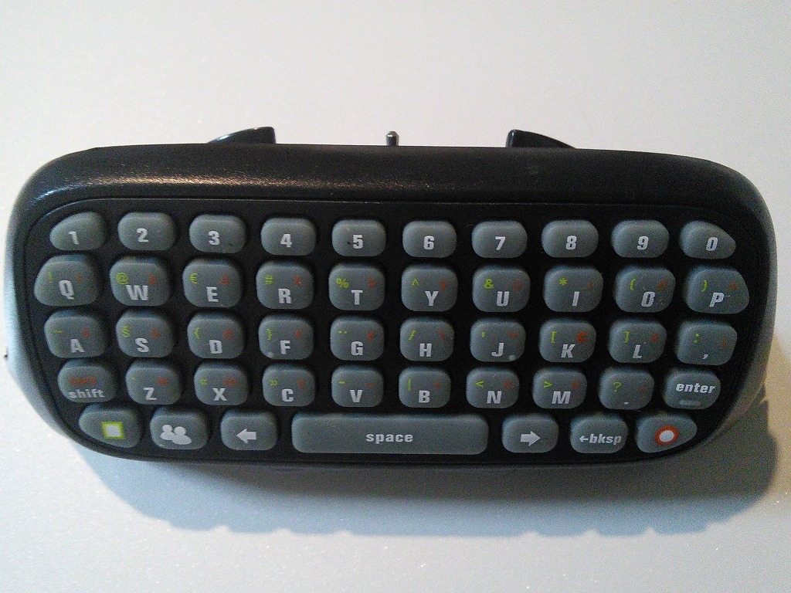

# IchigoJam のためのモバイルキーボード
Xbox ChatpadとSTM32F103を、IchigoJamのモバイルキーボードとして使うためのスケッチです.
Microsoft製のXbox Chatpadで動作しますが、Microsoft製のXbox Chatpadが入手しにくいため、比較的入手しやすいクローン(例えば、TYX-517PCB1 Ver2.5)が代替品として使用出来ます.
注意点としまして、日本語版のXbox Chatpadは、本ライブラリーで定義しているキーの配置と異なるため、印刷されているキーと違う動作をします.
Microsoft製のXbox Chatpadはクローンより高速に起動します.
****おおさかJ3****さんのHPにIchigoJamモバイルキーボードの完成作品が多数アップされています.(http://jr3kqf.webcrow.jp/ichigojam1.html)

※写真のIchigoJamはKumaJamです。

本ライブラリはSTM32F103を使用したBlue Pillで動作の確認をしています.
本ライブラリは次を参考に作成しています.
> - たま吉さん      https://github.com/Tamakichi/ArduinoSTM32_PS2Keyboard
> - Cliff L. Biffle http://cliffle.com/project/chatpad
> - ps2dev : Chris J. Kiick , Gene E. Scogin  http://playground.arduino.cc/ComponentLib/Ps2mouse
## 必要なもの
- Xbox 360 Chatpad
- STM32duino ブートローダーの導入済みのSTM32F103マイコン(Blue Pill)
- STM32 Arduino ライブラリ(https://github.com/rogerclarkmelbourne/Arduino_STM32)
- Arduino IDE環境(1.8.5で確認)

## 著作権/使用条件(License)
**このアーカイブに含まれるps2devライブラリを除くソースコード、テキスト及びデータ**の著作権は**Kei Takagi**が所有しています.
本アプリケーションの改造や使用は、使用者個人の責任のもとに行ってください.
本アプリケーションを実行した結果について何らかの不具合が発生したとしても、作者は一切の責任を負いませんので、あらかじめご了承ください.
著作権者の同意なしに金銭を伴う再配布を行う事を固く禁じます.
この条件のもとで、利用、複写、改編、再配布を認めます.

## Xbox Chatpad(Maicrosoft製および、AmazonやAliexpressで購入可能なクローン)の改造
### 1.前面

### 2.分解します
####特殊なネジが使われています

### 3.ニッパでキーボードのまわりの形を整えます

####切って終わった後はヤスリで磨いてください

### 5.不要な配線を取り除きます
####必要な配線は以下の写真を参考にしてください.
【配線】
- グリーン : 3.3Vへ接続
- ブラウン : STM32F103のSerial2であるA2へ接続
- ブルー  : STM32F103のSerial2であるA3へ接続
- イエロー : GNDへ接続

####STM32F103のSerial2へ接続

### 6.IchigoJamへ接続
【配線】
- B4：IchigoJamのKBD1
- B5: IchigoJamのKBD2

####kumaJam(IchigoJam)

### 7.スケッチの書き込みと設定

## 使い方
最初にBlue Pileの電源ON、次にIchgoJamの電源ONの順番でお願します.
Blue PileのLEDが等間隔に点滅している場合は正常に接続できていません.
全ての電源を切り、配線を確認したのち、電源を順番に入れなおしてみてください.

## キーボードに印刷されていないキー操作について
|**動作**|**操作**|
|--------|--------|
|上移動|緑□ + →|
|下移動|緑□ + ←|
|実行中のプログラム停止2|人 + E|
|!|shift + 1|
|"|shift + 2|
|#|shift + 3|
|$|shift + 4|
|%|shift + 5|
|&|shift + 6|
|'|shift + 7|
|(|shift + 8|
|)|shift + 9|

## キーボードの定義を変えたい場合
キーボードの定義を変更したい場合はKChatpad.cppのAsciiTable[] を変更してください.
配列の順番は、Normal, shif, Green, orange , Peopleになります.

##注意
Blue Pill,Xbox Chatpadは3.3Vで動作します.そのため、3.3V以外で動作するマイコン例えば、Arduino UNO(5V)へは直接接続しないでください.

##他の3.3V系のマイコンにPS/2キーボードとして使用したい場合
****おおさかJ3****さんより3.3V系のマイコンとして、ORENGE pico、IchigoLatteに接続し動作したとの報告を、いただいています。その際に、プルアップ抵抗(1-10KΩ)が必要になるものがあります.

## キーリピートについて
- キーリピートには対応しておりません

## 今後の予定について
- 日本語キーボード対応